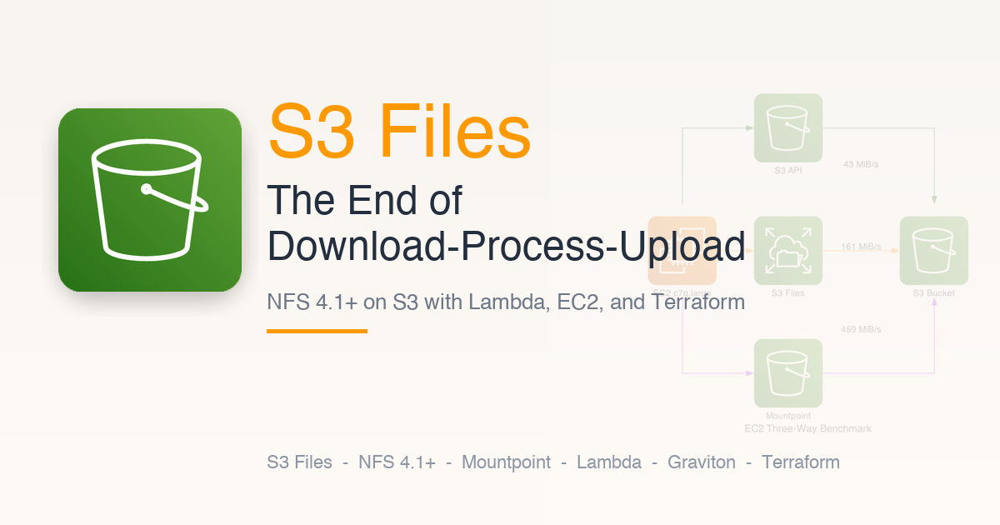
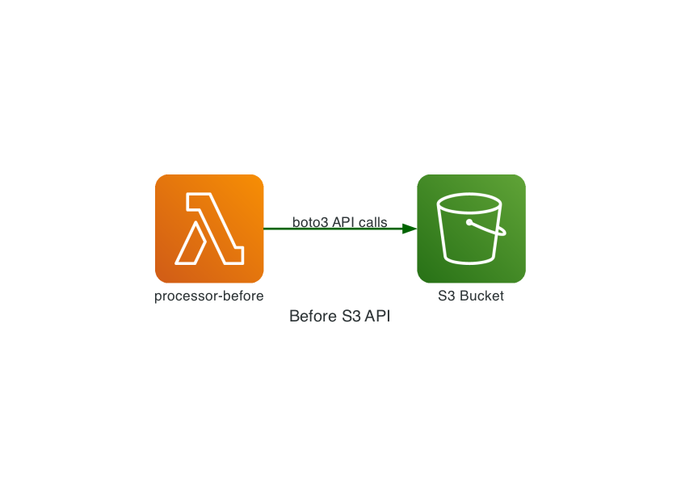
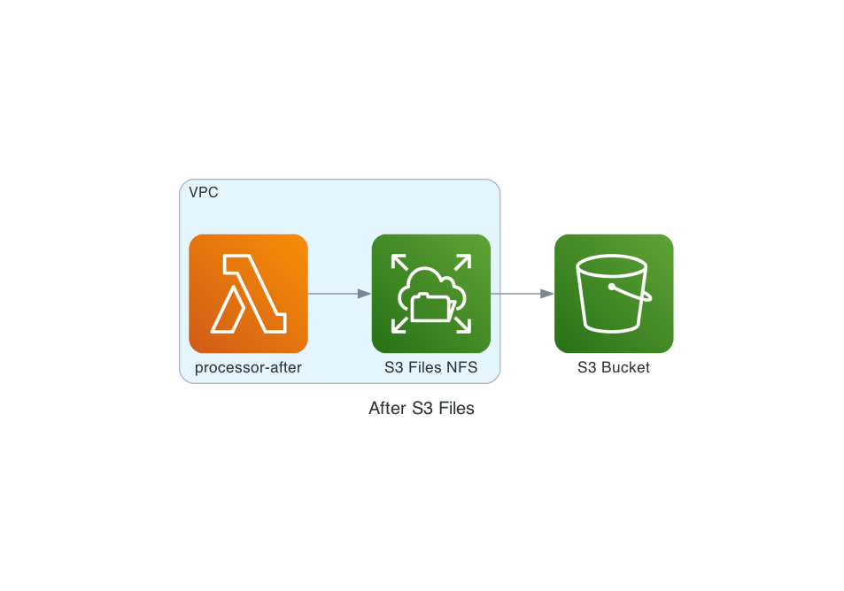
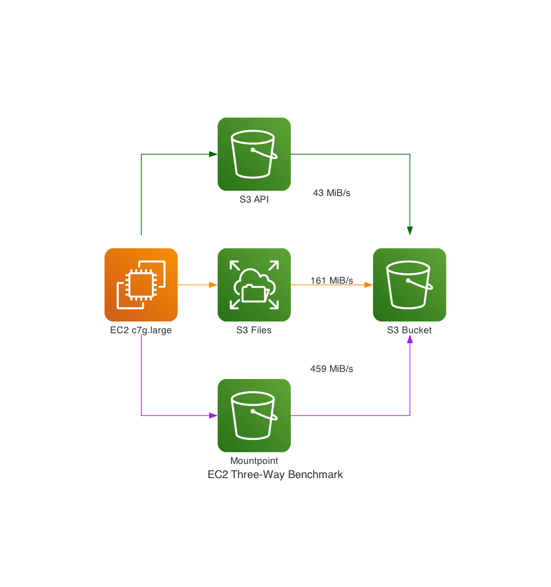

# S3 Files: The End of Download-Process-Upload



Companion code for the blog post demonstrating AWS S3 Files - the managed NFS v4.1/4.2 layer that lets you mount S3 buckets as local file systems on Lambda, EC2, ECS, and EKS.

This project deploys two identical document-processing Lambda functions side by side, plus a Graviton EC2 instance for a three-way comparison with Mountpoint for S3:

- **Before**: Traditional S3 API approach (boto3 download to /tmp, process, upload back)
- **After**: S3 Files mounted at /mnt/docs (pure file-system operations, no boto3 needed)
- **EC2 Three-Way**: S3 API vs S3 Files vs Mountpoint on the same host (large directories + large files)

This repo accompanies a blog post on S3 Files, Terraform, Powertools for Lambda, and Mountpoint benchmarking.

All infrastructure is managed with Terraform (AWS provider >= 6.40). Compute sizes, instance types, bucket names, regions, and all other resources are fully configurable via `terraform.tfvars`.

## Prerequisites

- AWS CLI v2.34.26+ (for `aws s3files` commands)
- Terraform >= 1.14.0
- Python 3.14+ (Lambda runtime; 3.13+ on the orchestrator machine is fine)
- `jq` installed
- An AWS account with permissions to create VPC, Lambda, S3, EC2, and IAM resources

## Quick Start

```bash
# 1. Configure Terraform variables
cp infrastructure/terraform.tfvars.example infrastructure/terraform.tfvars
# Edit terraform.tfvars with your AWS profile and region

# 2. Deploy infrastructure
make init
make apply

# 3. Run the Lambda benchmark (S3 API vs S3 Files)
make seed
make benchmark

# 4. Run the EC2 three-way benchmark (S3 API vs S3 Files vs Mountpoint)
make deploy-runner
make wait-ec2
make benchmark-ec2
```

## Architecture

### Lambda: Before (Traditional S3 API)



```
Lambda Function
  |-- boto3.download_file() --> /tmp/file.txt
  |-- process file in /tmp
  |-- boto3.upload_file() --> s3://bucket/processed-before/
  |-- boto3.delete_object() --> s3://bucket/inbox-before/
  '-- boto3.put_object() --> s3://bucket/reports-before/
```

### Lambda: After (S3 Files)



```
Lambda Function
  |-- /mnt/docs/inbox-after/file.txt      (just open() and read)
  |-- process file in memory
  |-- /mnt/docs/processed-after/file.txt  (just open() and write)
  |-- os.rename() inbox -> processed      (instant, no copy+delete)
  '-- /mnt/docs/reports-after/summary.json (just write)
```

### EC2: Three-Way Comparison



Mountpoint for S3 can't run on Lambda (no FUSE support), so the three-way comparison runs on a Graviton EC2 instance with all three interfaces mounted against the same bucket.

The two Lambdas use separate prefixes (`*-before/` vs `*-after/`) so the `before` Lambda's S3 writes don't collide with the `after` Lambda's NFS writes in the same directory - see the "Access Point Ownership" section in the blog post for why this matters.

## Make Targets

### Terraform and Lambda

| Target | Description |
|--------|-------------|
| `make init` | Initialize Terraform |
| `make plan` | Preview infrastructure changes |
| `make apply` | Deploy all infrastructure (Lambda + EC2 + VPC + S3 Files) |
| `make destroy` | Tear down all infrastructure |
| `make seed` | Seed both inbox prefixes with 20 medium files each |
| `make invoke-before` | Run the traditional S3 API Lambda |
| `make invoke-after` | Run the S3 Files mounted Lambda |
| `make benchmark` | Lambda benchmark: S3 API vs S3 Files (3 runs x 20 files) |

### EC2 Three-Way Benchmark (S3 API vs S3 Files vs Mountpoint)

| Target | Description |
|--------|-------------|
| `make deploy-runner` | Upload the runner script to EC2 via S3 + SSM |
| `make wait-ec2` | Wait for SSM agent to come online after deploy |
| `make benchmark-ec2` | Full three-way: 10K small files + 5x1 GiB binaries, 3 runs |
| `make benchmark-ec2-list` | List-directory test only (10K files) |
| `make benchmark-ec2-large` | Large-file test only (5x1 GiB) |
| `make ec2-ssh` | Interactive SSM session to the benchmark instance |
| `make ec2-logs` | View EC2 user-data bootstrap log |

### Other

| Target | Description |
|--------|-------------|
| `make status` | Show current file counts per prefix |
| `make logs-before` | Tail CloudWatch logs for the before Lambda |
| `make logs-after` | Tail CloudWatch logs for the after Lambda |
| `make clean` | Remove local build artifacts |

## Cost Estimate

| Resource | Approx. Cost |
|----------|-------------|
| S3 bucket (minimal data) | about $0.02/month |
| S3 Files (active data) | $0.30/GB-month + $0.03/GB reads + $0.06/GB writes |
| VPC (no NAT gateway) | $0 |
| VPC interface endpoints (SSM x3) | about $21/month |
| Lambda (on-demand invocations) | about $0 |
| EC2 c7g.large (benchmark host) | about $53/month if left running |
| CloudWatch logs | < $1/month |

**Total: about $75/month** if left running. Most of the cost comes from the EC2 instance and SSM endpoints. Stop or terminate the EC2 instance and remove SSM endpoints when you're not actively benchmarking. Run `make destroy` when done to avoid ongoing charges.

## Terraform Note

This project uses native S3 Files resources (`aws_s3files_file_system`, `aws_s3files_mount_target`, `aws_s3files_access_point`) added in AWS provider [v6.40.0](https://github.com/hashicorp/terraform-provider-aws/releases) (April 8, 2026). Make sure your provider version is `>= 6.40` or later.

## Project Structure

```
s3-files-demo/
+-- README.md                       # This file
+-- Makefile                        # All operations
+-- test-events/                    # Lambda test payloads
+-- src/
|   +-- processor_before/           # Traditional S3 API Lambda (Powertools instrumented)
|   +-- processor_after/            # S3 Files mounted Lambda (Powertools instrumented)
|   '-- ec2_runner/
|       '-- benchmark.py            # EC2-side three-way benchmark runner
+-- scripts/
|   +-- seed_inbox.py               # Lambda test data generator
|   +-- benchmark.py                # Lambda benchmark: S3 API vs S3 Files
|   '-- ec2_benchmark.py            # EC2 orchestrator: S3 API vs S3 Files vs Mountpoint (via SSM)
+-- infrastructure/
|   +-- modules/
|   |   +-- storage/                # S3 bucket + versioning + encryption + S3 Files IAM role
|   |   +-- s3-files/               # S3 Files file system, mount targets, access point
|   |   +-- networking/             # VPC + subnets + endpoints (S3 Gateway, SSM Interface) + SGs
|   |   +-- lambda-before/          # Traditional Lambda (no VPC, Powertools layer)
|   |   +-- lambda-after/           # S3 Files Lambda (VPC + NFS mount, Powertools layer)
|   |   '-- ec2-benchmark/          # Graviton EC2 (S3 Files NFS + Mountpoint FUSE + SSM)
|   +-- main.tf, variables.tf, outputs.tf
|   +-- providers.tf, versions.tf
|   '-- terraform.tfvars.example
'-- generated-diagrams/             # Architecture diagrams (PNGs)
```

## Cleanup

```bash
make destroy
```

This tears down all Terraform-managed AWS resources. Don't forget - the EC2 instance, SSM VPC endpoints, and S3 Files mount targets have ongoing charges if you leave the stack deployed.

## Related Blog Posts

- [S3 Files: The End of Download-Process-Upload](https://darryl-ruggles.cloud/s3-files-the-end-of-download-process-upload) - The blog post this repo accompanies
- [Lambda Managed Instances with Terraform](https://darryl-ruggles.cloud/lambda-managed-instances-with-terraform-multi-concurrency-high-memory-and-compute-options) - High-memory Lambda patterns that complement S3 Files
- [Powertools for AWS Lambda - Best Practices By Default](https://darryl-ruggles.cloud/powertools-for-aws-lambda-best-practices-by-default) - Observability patterns used in this project
- [EKS Auto Mode with Terraform](https://darryl-ruggles.cloud/eks-auto-mode-with-terraform) - Another infrastructure-as-code deep dive

## Connect

[X](https://x.com/RDarrylR) | [Bluesky](https://bsky.app/profile/darrylruggles.bsky.social) | [LinkedIn](https://www.linkedin.com/in/darryl-ruggles/) | [GitHub](https://github.com/RDarrylR) | [Medium](https://medium.com/@RDarrylR) | [Dev.to](https://dev.to/rdarrylr) | [AWS Community](https://community.aws/@darrylr) | [darryl-ruggles.cloud](https://darryl-ruggles.cloud) | [Believe In Serverless](https://www.believeinserverless.com/)

## License

MIT
